# Relationships
DB entity relationships

## users
- 1 -> many organizations (organizations.created_by)
- 1 -> many teams (teams.created_by)
- 1 -> many events (events.created_by)
- 1 -> many songs (songs.created_by)
- 1 -> many blockouts (blockouts.user_id)
- 1 -> many team_memberships (team_memberships.user_id)
- 1 -> many team_invites (team_invites.created_by)

## organizations
- 1 -> many teams (teams.org_id)
- 1 -> many org_team_memberships (org_team_memberships.org_id)
- 1 -> many events (events.org_id)
- 1 -> many songs (songs.org_id)
- 1 -> many blockouts (blockouts.org_id)
- many -> 1 users (organizations.created_by)

## teams
- many -> 1 organizations (teams.org_id)
- 1 -> many org_team_memberships (org_team_memberships.team_id)
- 1 -> many team_memberships (team_memberships.team_id)
- 1 -> many team_invites (team_invites.team_id)
- many -> 1 users (teams.created_by)

## org_team_memberships
- many -> 1 organizations (org_team_memberships.org_id)
- many -> 1 teams (org_team_memberships.team_id)

## team_memberships
- many -> 1 teams (team_memberships.team_id)
- many -> 1 users (team_memberships.user_id)

## team_invites
- many -> 1 teams (team_invites.team_id)
- many -> 1 users (team_invites.created_by)

## events
- many -> 1 organizations (events.org_id)
- many -> 1 users (events.created_by)
- 1 -> many event_songs (event_songs.event_id)

## songs
- many -> 1 organizations (songs.org_id)
- many -> 1 users (songs.created_by)
- 1 -> many event_songs (event_songs.song_id)

## blockouts
- many -> 1 organizations (blockouts.org_id)
- many -> 1 users (blockouts.user_id)

## event_songs
- many -> 1 events (event_songs.event_id)
- many -> 1 songs (event_songs.song_id)

## implied many-to-many
- events <-> songs (via event_songs)

# Diagram

